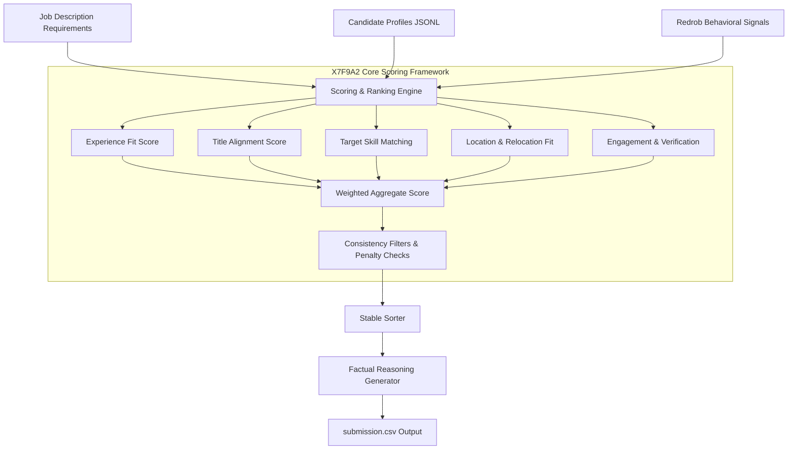
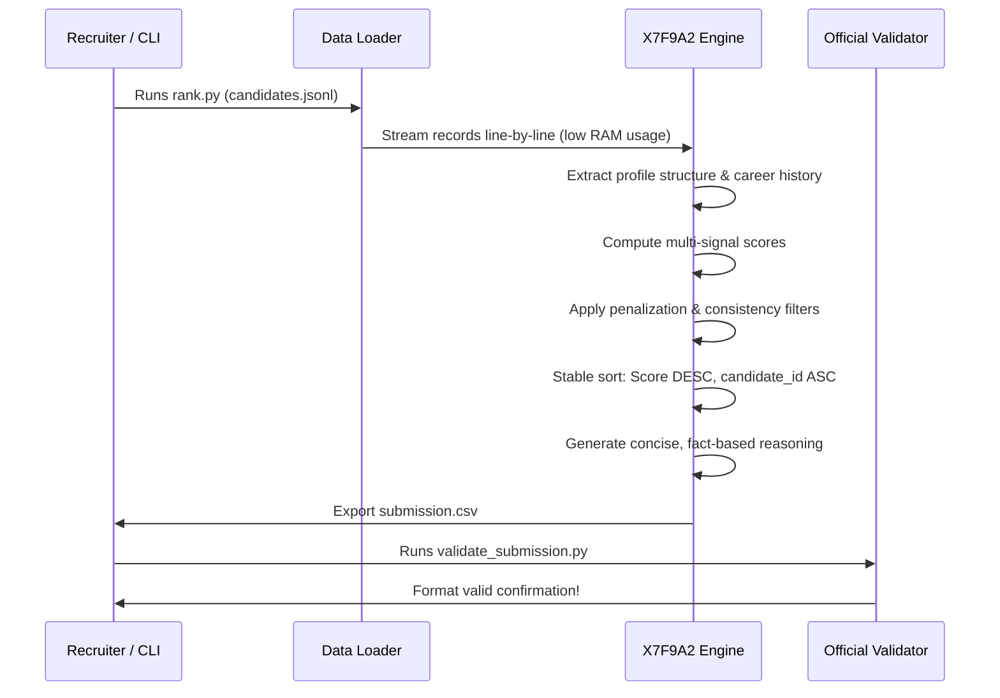

# 🏆 AI Candidate Ranking Platform

### Intelligent Candidate Evaluation & Ranking

Welcome to the AI Candidate Ranking Platform, an interactive application for evaluating and ranking candidate profiles using a deterministic scoring engine.

<p align="center">
  
</p>

Upload a candidate dataset in **JSON** or **JSONL** format to:

* Analyze candidate profiles against predefined evaluation criteria
* Generate standardized suitability scores
* Provide transparent reasoning for each evaluation
* Rank candidates based on their overall performance
* Export the complete ranked results as a CSV report

The platform is designed to deliver **consistent, objective, and explainable** candidate assessments, enabling efficient review and comparison of large candidate datasets.

---

## 👥 Team Identity

* **Team Name**: X7F9A2
* **Solo Participant**: PRANAY NAMPALLY
* **Email**: npranay2006@gmail.com
* **Phone**: +91-9440971722
* **Hugging Face Sandbox**: [https://huggingface.co/spaces/npran24/redrob_h2s_hackathon](https://huggingface.co/spaces/npran24/redrob_h2s_hackathon)
* **GitHub Repository**: [https://github.com/NAMPALLY-PRANAY/redrob_h2s_hackathon](https://github.com/NAMPALLY-PRANAY/redrob_h2s_hackathon)

---

## 🎯 Problem Statement & Objective

Traditional Applicant Tracking Systems (ATS) rely heavily on exact keyword matching, which fails to capture candidates who express experience differently or penalize qualified profiles that don't load resumes with spam keywords.

The **X7F9A2 Engine** implements a deterministic multi-signal ranking framework that:
1. Matches semantic concepts across career history and skill matrices.
2. Models candidate availability, activity, and notice periods using behavioral signals.
3. Leverages a weighted scoring matrix to rank the top 100 candidates.
4. Generates concise, fact-based explanations for recruiter review.

---

## 🏗️ System Architecture

The following diagram illustrates the candidate processing and evaluation lifecycle:



---

## 📊 Scoring Component Details

The engine evaluates candidates across several dimensions to balance technical alignment, availability, and retention signals:

### 1. Experience Fit Score (30% weight)
Uses a piece-wise function that maps total years of experience, peaking in the **5 to 9 years** range (ideal for a Senior role) and penalizing profiles with too little (e.g. <3 years) or excess seniority.

### 2. Title & Role Alignment (15% weight)
Assigns positive weights for target titles (e.g., `Machine Learning Engineer`, `AI Engineer`, `Search/Ranking Engineer`) and strong negative penalties for unrelated domains (e.g., `Marketing`, `HR`, `Accountant`).

### 3. Skill & Keyword Matching (25% weight)
Extracts target technologies including Python, embeddings, vector databases (Faiss, Milvus, Qdrant, Pinecone), Sentence Transformers, learning to rank, MLOps tools, and LLM fine-tuning techniques.

### 4. Behavioral Signals (15% weight)
Leverages `redrob_signals` to boost candidates who are actively open to work, respond quickly to recruiters, have verified accounts, and exhibit high Git activity scores, while applying penalties for extremely long notice periods (e.g. >90 days).

### 5. Location & Work Proximity (10% weight)
Boosts candidates residing in or willing to relocate to key tech centers in India (Pune, Noida, Bengaluru, Mumbai, Delhi-NCR, Hyderabad), and matches preferred work modes.

### 6. Consistency Filters (5% weight)
Cross-references profile claims with career history details (e.g. checks for keyword stuffing or experience inflation) and penalizes inconsistencies.

---

## 🔄 Data Pipeline Flow



---

## 📁 Repository Structure

```text
redrob_h2s_hackathon/
│
├── README.md                      # Detailed project documentation & diagrams
├── LICENSE                        # MIT License
├── submission_metadata.yaml       # Challenge portal metadata verification
├── requirements.txt               # App and environment dependencies
├── rank.py                        # Core deterministic ranking pipeline script
├── app.py                         # Gradio sandbox application for local & HF Spaces
├── validate_submission.py         # Official format validation script
├── submission.csv                 # Generated top-100 candidates submission file
├── logo.png                       # Team X7F9A2 logo (LFS tracked)
│
└── data/                          # Folder for raw datasets & guidelines
    ├── candidate_schema.json      # Candidate record JSON schema definition
    ├── sample_candidates.json     # Official candidate evaluation sample subset
    ├── job_description.docx       # Senior AI Engineer job description
    ├── redrob_signals_doc.docx    # Behavioral signals explanation
    ├── submission_spec.docx       # Challenge rules and requirements
    └── sample_submission.csv      # Starter submission file template
```

---

## ⚡ Reproducibility & Execution

Follow these instructions to run the engine locally or launch the Gradio sandbox:

### Prerequisites
Make sure Python 3.10+ is installed on your machine.

### 1. Local Pipeline Execution
Run the core ranking script to regenerate the `submission.csv` file from candidate data:
```bash
python rank.py --candidates ./candidates.jsonl --out ./submission.csv
```
*(Note: It also works with gzip files like `candidates.jsonl.gz`)*

### 2. Format Validation
Verify that the output format strictly complies with the hackathon validation rules:
```bash
python validate_submission.py submission.csv
```

### 3. Interactive Premium SaaS Sandbox
The sandbox has been completely redesigned into a premium, commercial-grade AI Web Application resembling ChatGPT, Claude, and Perplexity. It includes:
* **Interactive Control Sidebar**: Tune ranking weights dynamically (Experience, Role Title, Location Fit, Behavioral Signal, Exact Skill Matching, Text Relevance, Career Strength, Consistency).
* **Cloud-Storage Upload Experience**: Modern drag-and-drop landing state with a progressive checklist loading indicator.
* **Interactive Charting (Plotly)**: Visualizes score distributions, years of experience alignment, and technical skill frequencies with zoom, hover, and fullscreen capabilities.
* **Recruiter Profile Inspector**: Select any candidate from the dropdown to load an explainable scorecard detail card displaying score contributions (radar/bar format) and signal importance.
* **AI Insights Chatbot**: Query the active dataset interactively (e.g. *"Who is the top candidate and why?"*, *"Show common technical skills"*, *"List India-based candidates"*).

First, install the dependencies:
```bash
pip install -r requirements.txt
```
Next, launch the app:
```bash
python app.py
```
Open your browser to `http://localhost:7860`, upload `sample_candidates.json`, and interact with the candidate evaluation pipeline.

---

## 🔮 Future Improvements

1. **Hybrid Retrieval**: Combine BM25 semantic text scores with Dense Retrieval Embeddings.
2. **Cross-Encoder Reranking**: Utilize a lightweight cross-encoder model to capture nuanced experiences.
3. **Learning to Rank (LTR)**: Train a gradient boosted decision tree (GBDT) model calibrated directly with recruiter interaction logs.
4. **LLM Extraction**: Use fine-tuned models to extract structured parameters from unformatted job descriptions.
